# Modern Box Plot

Sparkline-sized distribution widget for React. Drop it into a table cell and it renders a tiny box plot; click it and it opens a full histogram, summary statistics, and an automatic best-fit explanation — in plain English, not a p-value.

Built with pure SVG and TypeScript — no charting libraries.

**The pitch:** presenting a distribution well is genuinely hard — pick the right axis, notice the zero-inflated spike, don't lie about a sampled top-25, phrase a week-over-week shift so a non-technical reader gets it. This component has already made those calls. You pass it an array; it decides how to show it.

## Install

```bash
npm install modern-boxplot-react
```

## Quick Start

```tsx
import { BoxPlotSparkline } from 'modern-boxplot-react'

<BoxPlotSparkline data={[1, 2, 3, 4, 5, 6, 7, 8, 9, 10]} />
```

## See a distribution without opening anything

Every row here is a full column of raw data — clinical ages, API latencies, a zero-inflated count column — rendered at a glance. No axis to configure, no bucket size to pick.

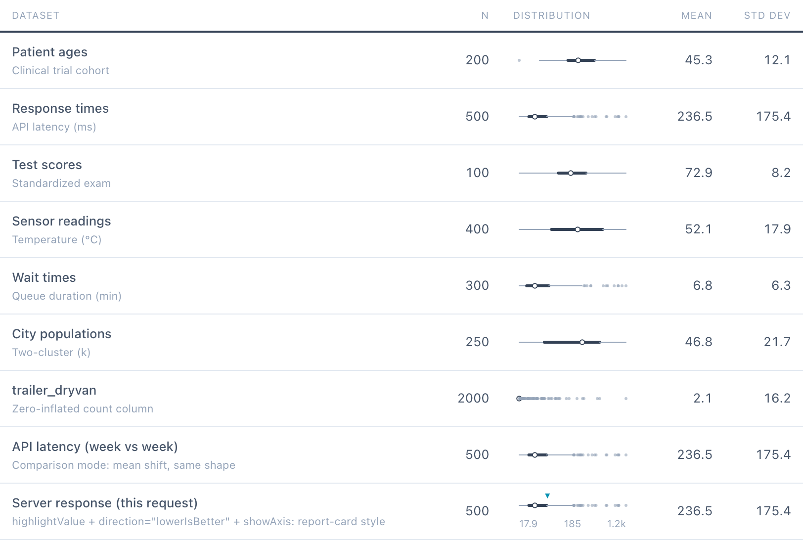

```tsx
<BoxPlotSparkline data={apiLatencies} variant="tufte" size="md" />
```

## Click through for the full picture

Click any sparkline and it opens a histogram with a KDE density curve, annotated min/Q1/median/mean/Q3/max markers, and — the part you'd normally have to write yourself — a best-fit match against Normal, Log-Normal, Exponential, Uniform, Bimodal, and Zero-inflated shapes, explained in a sentence a non-statistician can read.

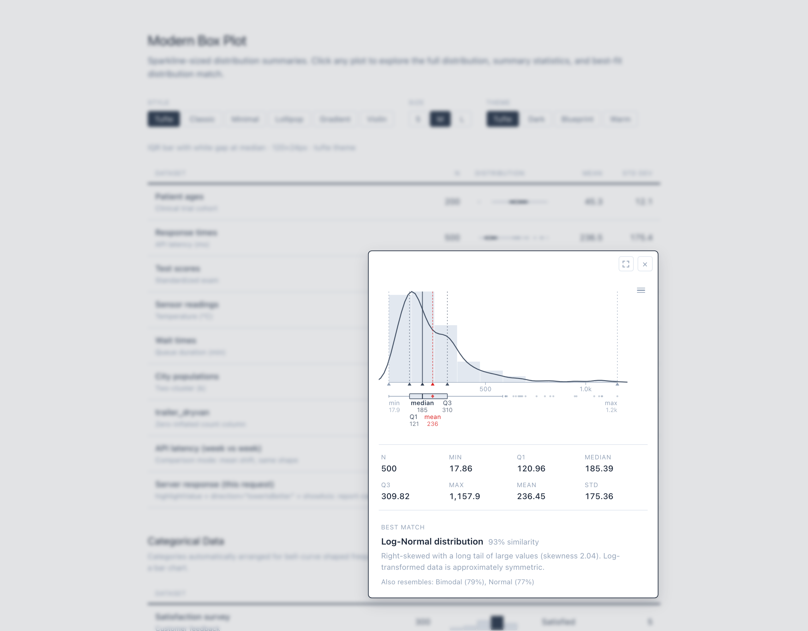

No configuration for any of this — it's computed from the same `data` array you already passed to the sparkline.

## It won't lie to you about ugly data

Real columns are rarely clean bell curves. This one is 97% zeros with a rare, extreme tail — the kind of column that makes a naive linear-axis histogram look like a single spike and a flat line. The library detects the zero-inflation, calls it out by name in the match card, and a one-click log-scale toggle reveals the actual shape hiding in the tail:

<table><tr>
<td width="50%">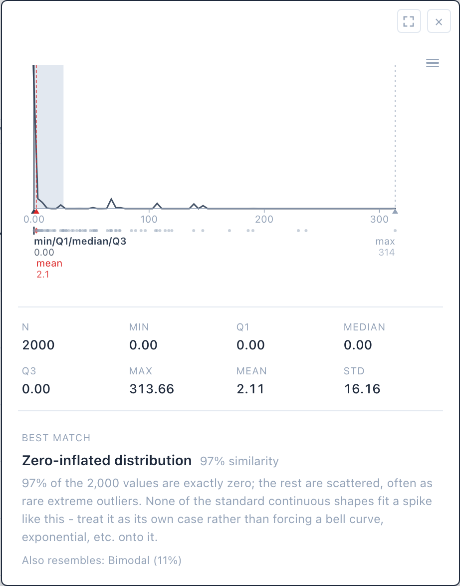<br><sub>Linear axis (the default) — mostly useless</sub></td>
<td width="50%">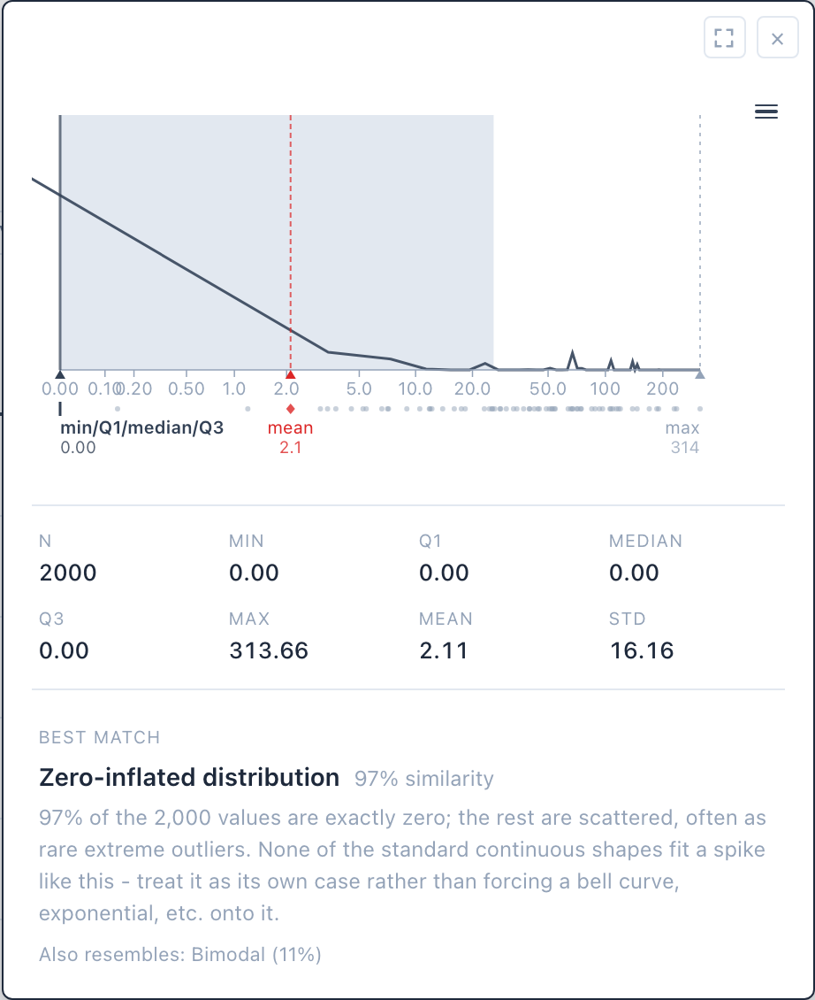<br><sub>One click: <code>Chart options → Log</code></sub></td>
</tr></table>

The chart options menu (☰) also has drag-to-zoom and "Zoom to IQR," so a customer can dig into a crowded tail without you building a second chart for it.

## Comparing two snapshots

Pass a second array as `compareData` and the popover overlays it — this week vs. last week, train vs. test, before vs. after a fix — with a delta table and a shape-change verdict computed for you, plus (for categorical data) new/vanished categories and the biggest movers.

<table><tr>
<td width="50%">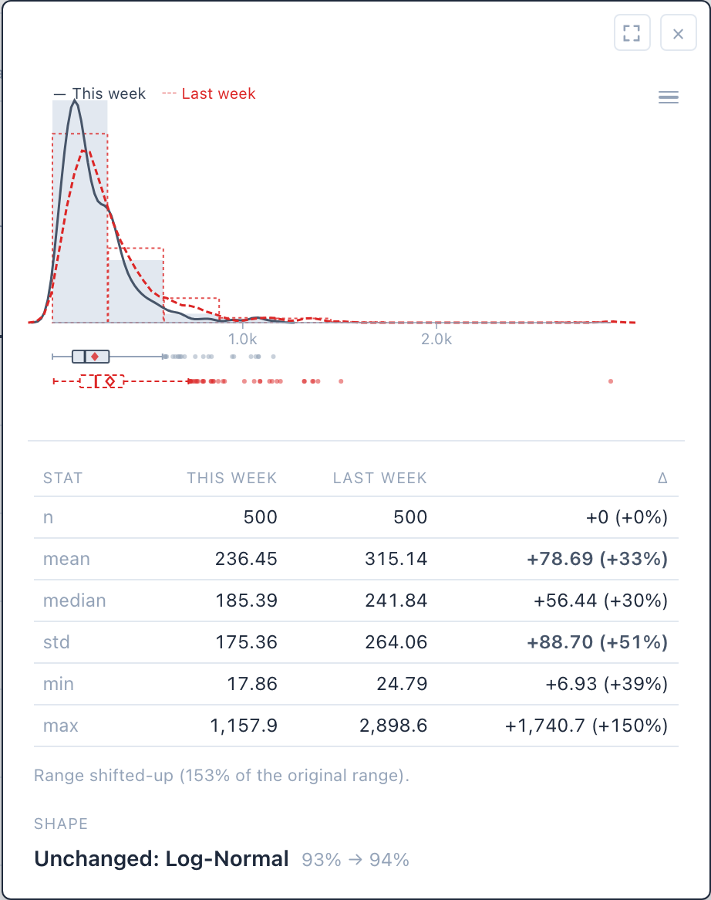</td>
<td width="50%">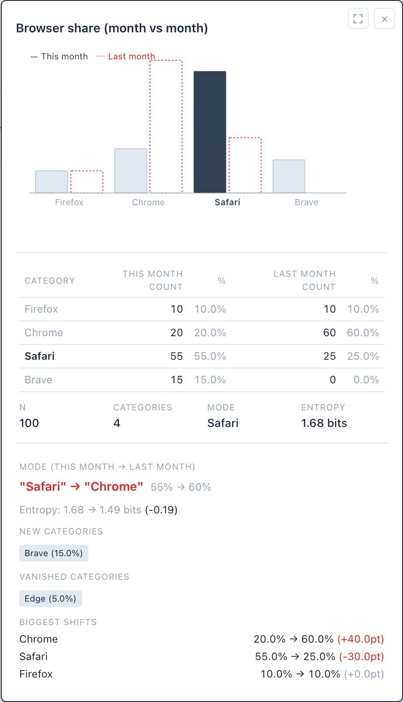</td>
</tr></table>

```tsx
<BoxPlotSparkline
  data={thisWeek} compareData={lastWeek}
  label="This week" compareLabel="Last week"
/>
```

## Flagging one value against the crowd

For report-card-style UI — "how does this one customer/request/order compare?" — pass `highlightValue` and it's plotted against the full distribution using the chart's real internal scale, not a manually-eyeballed pixel offset. Add `direction` and it auto-generates a percentile sentence instead of a bare, ambiguous number.

<table><tr>
<td width="50%">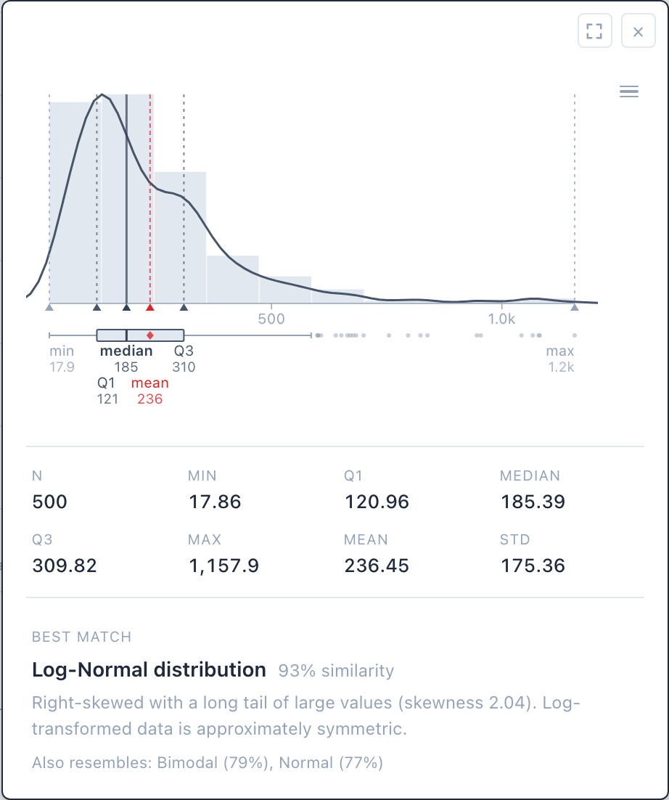<br><sub>Plain</sub></td>
<td width="50%">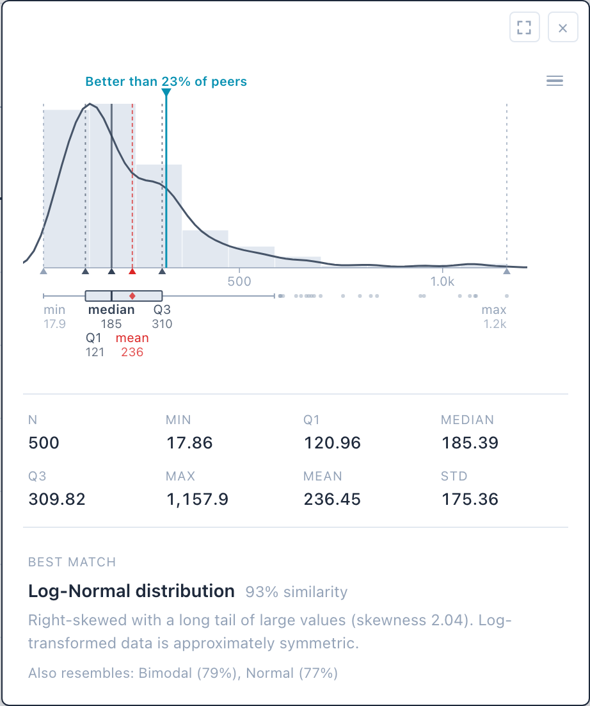<br><sub>+ <code>highlightValue</code> and <code>direction="lowerIsBetter"</code></sub></td>
</tr></table>

```tsx
<BoxPlotSparkline
  data={peerLatencies}
  highlightValue={thisRequestMs}
  direction="lowerIsBetter"   // → "Better than 23% of peers"
  showAxis                     // adds min/median/max ticks to the compact glyph too
/>
```

## Categorical data, honestly

Pass a string array or a `value_counts()`-style dict and it renders as a bar chart instead, with categories auto-arranged for a bell-curve-shaped profile, entropy, and a bell-curve fit score.

For the case every dashboard eventually hits — a column with 180,000 distinct values, where you can only afford to send the top 25 — pass `trueTotalCount`/`trueUniqueCount` and the popover keeps the real N in the headline stats and says exactly what it's showing, instead of silently mislabeling the sum of a truncated slice as the column's true count.

<table><tr>
<td width="50%">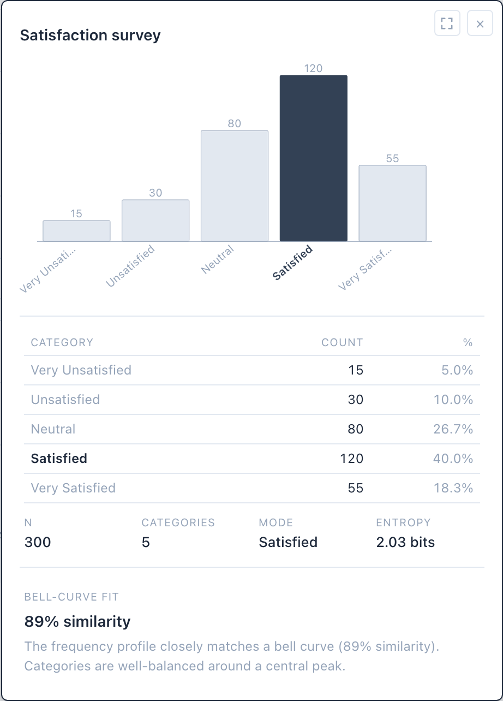</td>
<td width="50%">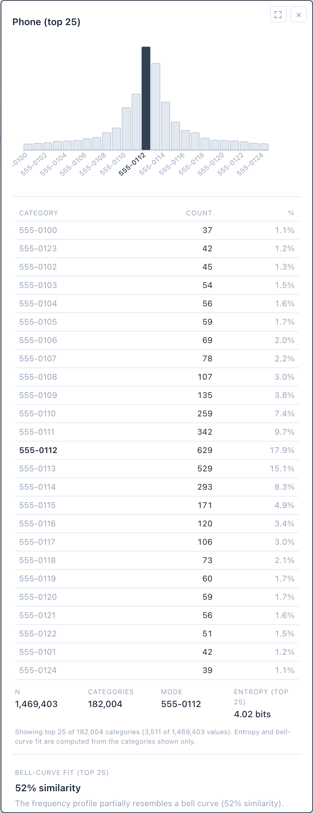</td>
</tr></table>

```tsx
<BoxPlotSparkline
  data={top25PhoneCounts}         // Record<string, number>
  trueTotalCount={1_469_403}      // real column N
  trueUniqueCount={182_004}       // real distinct-value count
/>
// → "Showing top 25 of 182,004 categories (3,511 of 1,469,403 values)"
```

## Presentation mode

Every popover has a full-screen toggle, so the same component that lives in a dense table cell can also carry a slide or a screen-share without you building a second, bigger version of the chart.

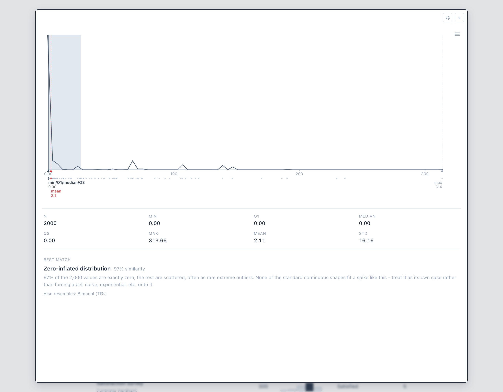

## Six rendering styles, four themes

Variant changes how the sparkline itself is drawn; theme changes color and typography. Both are swappable per-instance, so a report can mix styles or match a single brand.

<table><tr>
<td><br><sub><code>tufte</code></sub></td>
<td><br><sub><code>classic</code></sub></td>
<td><br><sub><code>minimal</code></sub></td>
<td><br><sub><code>lollipop</code></sub></td>
<td><br><sub><code>gradient</code></sub></td>
<td><br><sub><code>violin</code></sub></td>
</tr></table>

<table><tr>
<td width="33%">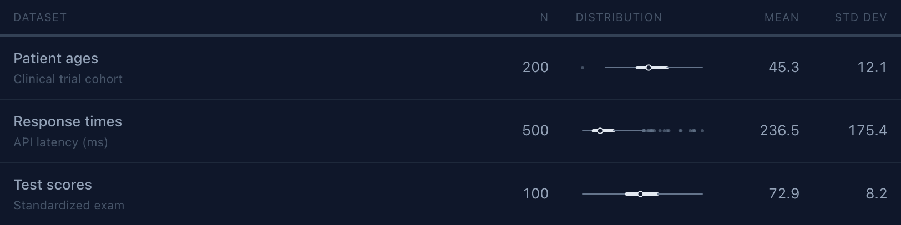<br><sub>dark</sub></td>
<td width="33%">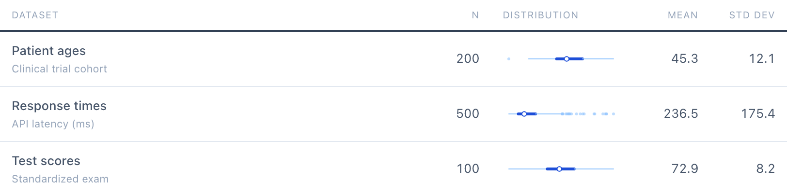<br><sub>blueprint</sub></td>
<td width="33%">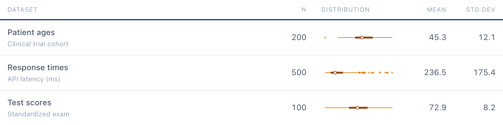<br><sub>warm</sub></td>
</tr></table>

(`tufte` — slate grayscale — is the default, shown throughout this README.)

## Props

### Core

| Prop | Type | Default | Description |
|------|------|---------|-------------|
| `data` | `number[] \| string[] \| ValueCounts` | required | Raw numeric array, raw string array, or a `value_counts()`-style dict |
| `variant` | `BoxPlotVariant` | `'tufte'` | Rendering style — see below |
| `size` | `BoxPlotSize` | `'md'` | Preset dimensions — see below |
| `theme` | `BoxPlotTheme` | `themes.tufte` | Color and typography theme |
| `width` / `height` | `number` | from `size` | Override dimensions in px |
| `title` | `string` | — | Title shown at the top of the popover (e.g. a column name) |
| `description` | `string` | — | Plain-language context shown under the title — what a viewer with no idea what column they're looking at needs to know |
| `footnote` | `string` | — | Footnote shown at the bottom of the popover |
| `categoryOrder` | `string[]` | auto (bell-curve) | Explicit category ordering for categorical data (e.g. Likert scales) |
| `showAxis` | `boolean` | `false` | Adds min/median/max tick labels below the compact sparkline itself (numeric only) |
| `showFitCurve` | `boolean` | `false` | Overlays a fitted Gaussian on the categorical bar chart |
| `showDensityCurve` | `boolean` | `true` | KDE curve on the numeric histogram — turn off for small/sparse samples where a smoothed curve implies more continuity than the data supports |
| `showDistributionMatch` | `boolean` | `true` | Best-fit distribution card (and, in comparison mode, the shape-match verdict) — turn off when a "best fit" framing isn't meaningful (tiny n, non-sampled data) |

### Comparison mode

| Prop | Type | Description |
|------|------|-------------|
| `compareData` | `number[] \| string[] \| ValueCounts` | A second snapshot to overlay against `data` |
| `label` / `compareLabel` | `string` | Snapshot labels (default `"Current"` / `"Comparison"`) |
| `trueTotalCount` / `trueUniqueCount` | `number` | True full-column counts when `data` is a truncated categorical slice |
| `compareTrueTotalCount` / `compareTrueUniqueCount` | `number` | Same, for `compareData` |

### Highlighting a value

| Prop | Type | Description |
|------|------|-------------|
| `highlightValue` | `number` | Marks a value against the numeric distribution, on the chart's real scale |
| `highlightCategory` | `string` | Marks a category against the categorical distribution |
| `direction` | `'higherIsBetter' \| 'lowerIsBetter'` | Frames the auto-generated percentile label; omit `highlightLabel` to use it |
| `highlightLabel` | `string` | Overrides the auto-generated highlight label entirely |

## Rendering Variants

| Variant | Description |
|---------|-------------|
| `tufte` | Tufte's redesigned box plot: thin IQR bar with a white gap at the median |
| `classic` | Traditional filled rectangle for IQR, median line, end caps on whiskers |
| `minimal` | Three vertical ticks (Q1, median, Q3) connected by a hairline |
| `lollipop` | Dots at all five-number summary positions, connected by a line |
| `gradient` | Horizontal bar with opacity ramp showing where data concentrates |
| `violin` | Mini KDE-based shape showing the actual distribution contour |

Categorical data always renders as a bar chart — `variant` has no effect on it.

## Sizes

| Size | Dimensions |
|------|------------|
| `sm` | 80 × 16 px |
| `md` | 120 × 24 px |
| `lg` | 180 × 32 px |

Override with `width` and `height` props for custom dimensions.

## Theming

Four built-in themes:

```tsx
import { BoxPlotSparkline, themes } from 'modern-boxplot-react'

<BoxPlotSparkline data={data} theme={themes.tufte} />     // slate grayscale (default)
<BoxPlotSparkline data={data} theme={themes.dark} />      // dark bg, light data ink
<BoxPlotSparkline data={data} theme={themes.blueprint} /> // blue tones on white
<BoxPlotSparkline data={data} theme={themes.warm} />      // earth/amber tones
```

### Custom Themes

Use `createTheme()` to override any part of a base theme:

```tsx
import { BoxPlotSparkline, themes, createTheme } from 'modern-boxplot-react'

const custom = createTheme(themes.tufte, {
  colors: { primary: '#8b5cf6', accent: '#a78bfa' },
  popover: { bg: '#faf5ff', border: '#7c3aed' },
})

<BoxPlotSparkline data={data} theme={custom} />
```

### Theme Structure

```ts
interface BoxPlotTheme {
  colors: {
    primary: string      // IQR bar, median — main data ink
    secondary: string    // Whiskers, outliers
    accent: string       // Connecting lines, subtle marks
    light: string        // Faint connecting lines
    faint: string        // Histogram bar fill, backgrounds
    mean: string         // Mean annotation color
    highlight?: string   // highlightValue/highlightCategory marker color (falls back to `mean`)
  }
  popover: {
    bg: string           // Popover background
    border: string       // High-contrast border
    text: string         // Primary text
    textMuted: string    // Secondary text
    rule: string         // Divider lines
    shadow: string       // Box shadow
    backdropColor: string // Backdrop overlay color
  }
  font: {
    family: string       // Font stack
    labelSize: number    // Label font size (px)
    valueSize: number    // Value font size (px)
  }
}
```

## Stats Engine

All statistics are computed in pure TypeScript with no external dependencies. You can use them directly:

```tsx
import {
  descriptiveStats, fiveNumberSummary, mean, stddev, skewness, kurtosis, percentileRank,
  matchDistributions,
  categoricalSummary,
  diffDescriptiveStats, diffDistributionMatch, diffCategoricalSummary,
} from 'modern-boxplot-react'

const stats = descriptiveStats([1, 2, 3, 4, 5])
// { n, min, max, mean, variance, stddev, skewness, kurtosis, fiveNum, outliers }

const matches = matchDistributions([1, 2, 3, 4, 5])
// [{ name, similarity, explanation }, ...]

const cats = categoricalSummary(['a', 'b', 'a', 'c'])
// { categories, totalCount, numCategories, mode, entropy, ... }

const diff = diffDescriptiveStats(statsA, statsB)
// { mean: { a, b, delta, deltaPct }, ..., flags: [...], rangeShift }
```

### Algorithms

- Five-number summary with linear interpolation quartiles (Excel PERCENTILE.INC style)
- Skewness (Fisher's moment coefficient) and excess kurtosis
- Kolmogorov-Smirnov goodness-of-fit scoring against reference distributions, including a dedicated zero-inflated detector
- Gaussian kernel density estimation with Silverman bandwidth
- Shannon entropy and a discrete-Gaussian bell-curve fit score for categorical data
- Snapshot-to-snapshot diffing with severity thresholds (`minor`/`notable`/`major`) for mean shift, std-dev ratio, n change, entropy change, and shape-match change

## Standalone Script Tag

For projects that don't use React, a self-contained bundle is available:

```html
<script src="https://unpkg.com/modern-boxplot-react/dist/modern-boxplot.standalone.js"><\/script>
<script>
  ModernBoxPlot.render(document.getElementById('plot'), {
    data: [1, 2, 3, 4, 5, 6, 7, 8, 9, 10],
    variant: 'tufte',
    size: 'md',
    theme: 'dark',
  })
<\/script>
```

> **Note:** the closing tags above are written as `<\/script>` (escaped
> forward slash), not `</script>`. If this example is ever copy-pasted or
> inlined verbatim into an actual `<script>` block (e.g. a tool that bundles
> docs into a single-file HTML page), a literal `</script>` in the middle of
> the block closes it early and silently breaks everything after it.

The standalone bundle also reads `data-compare-values`, `data-highlight-value`, `data-highlight-category`, `data-direction`, `data-show-axis`, `data-description`, `data-show-density-curve`, and `data-show-distribution-match` attributes, so comparison mode, highlighting, and the description/toggle props all work without React too.

## Development

```bash
npm install
npm run dev          # Demo page at localhost:5173
npm run build        # Library → dist/
npm run build:demo   # Demo site build
npm test             # Vitest unit tests
npm run test:e2e     # Playwright e2e tests
```

The screenshots in this README were generated from the demo app and its seeded datasets — see `scripts/generate-screenshots.mjs`.

## Exports

```ts
// Component
export { BoxPlotSparkline } from 'modern-boxplot-react'
export type { BoxPlotSparklineProps, BoxPlotVariant, BoxPlotSize } from 'modern-boxplot-react'

// Theming
export { themes, createTheme } from 'modern-boxplot-react'
export type { BoxPlotTheme } from 'modern-boxplot-react'

// Numeric stats
export { descriptiveStats, fiveNumberSummary, mean, stddev, skewness, kurtosis, percentileRank } from 'modern-boxplot-react'
export type { DescriptiveStats, FiveNumberSummary } from 'modern-boxplot-react'

// Distribution matching
export { matchDistributions, LOW_CONFIDENCE_THRESHOLD } from 'modern-boxplot-react'
export type { DistributionMatch } from 'modern-boxplot-react'

// Categorical stats
export { categoricalSummary, bellCurveOrder, countFrequencies, isValueCounts, mergedCategoryOrder } from 'modern-boxplot-react'
export type { CategoryFrequency, CategoricalSummary, ValueCounts, TrueCounts } from 'modern-boxplot-react'

// Snapshot diffing (comparison mode)
export { diffDescriptiveStats, diffDistributionMatch, diffCategoricalSummary } from 'modern-boxplot-react'
export type {
  DiffSeverity, DiffFlag, StatDelta, RangeShift, RangeShiftDirection,
  NumericDiff, ShapeDiff, CategoricalDiff, CategoryDelta, CategoryShift,
} from 'modern-boxplot-react'
```

## Author

**Mitch Haile**
- [mitchhaile.com](https://www.mitchhaile.com)
- [mitch.haile@gmail.com](mailto:mitch.haile@gmail.com)

## License

MIT
